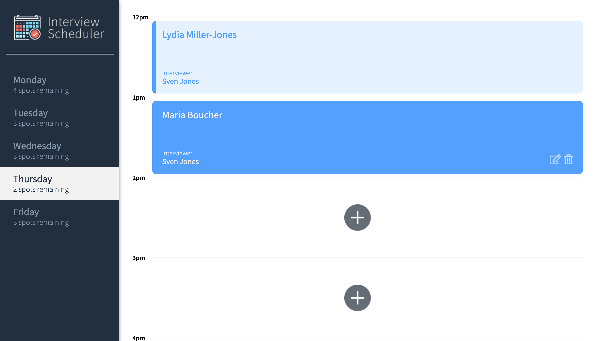
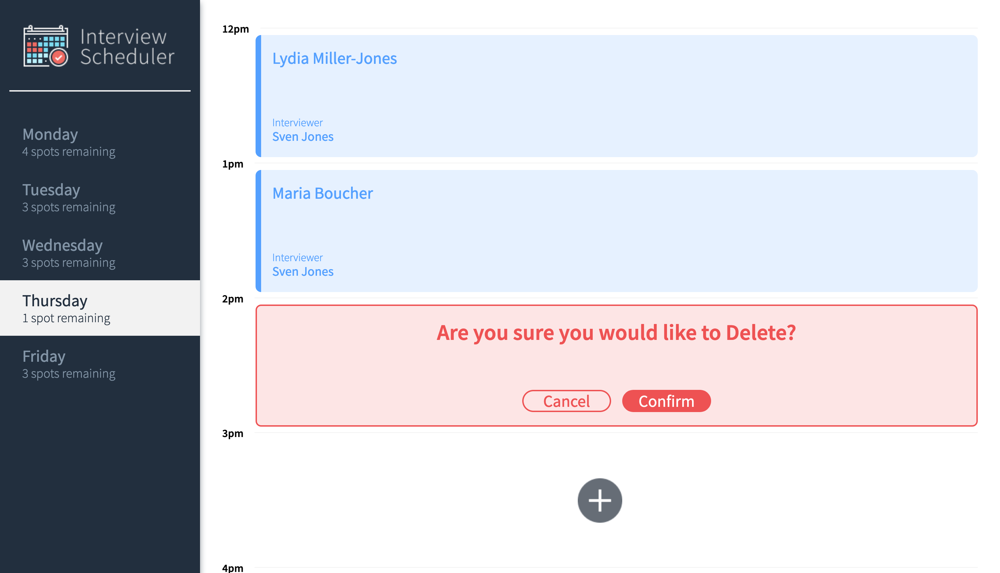

# Interview Scheduler

Interview Scheduler is a React application that allows users to book, edit, and cancel interview appointments.

It has been developed using React, and tested with Jest for Integration testing and Cypress for End-to-End testing.

## Final Product

Scheduler Main Page:

Scheduler Add Appointment:

Scheduler Delete Appointment:

## Purpose

**_BEWARE:_ This project was published for learning purposes. It is _not_ intended for use in production-grade software.**

This project was created and published by me as part of my learnings at Lighthouse Labs. 

## Key Features

* Interviews can be booked between Monday and Friday.
* A user can switch between weekdays.
* A user can book an interview in an empty appointment slot.
* Interviews are booked by typing in a student name and clicking on an interviewer from a list of available interviewers.
* A user can cancel an existing interview.
* A user can edit the details of an existing interview.
* The list of days informs the user how many slots are available for each day.
* The expected day updates the number of spots available when an interview is booked or canceled.
* A user is presented with a confirmation when they attempt to cancel an interview.
* A user is shown an error if an interview cannot be saved or deleted.
* A user is shown a status indicator while asynchronous operations are in progress.
* When the user presses the close button of the error they are returned to the Form or Show view (skipping Status and Confirm).
* The application makes API requests to load and persist data. We do not lose data after a browser refresh.

## Getting Started

1. Fork this repository, then clone the fork to your local machine.
2. Install dependencies using the `npm install` command.
3. Start the Webpack Development server using the `npm start` command. The app will be served at <http://localhost:8000/>.
4. Go to <http://localhost:8000/> in your browser.
5. Run the Jest testing framework with the `npm test` command.
6. Run the Storybook Visual Testbed with the `npm run storybook` command.

## Dependencies

- axios
- classnames
- normalize.css
- react
- react-dom
- react-scripts

